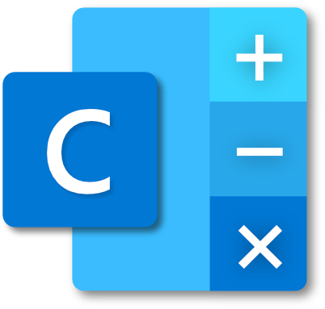

  

<h1 align="center">Visual Calculator</h1>

A scientific calculator for Windows 10.

  
  
  

# Overview

Given the number of native desktop calculators lacking a dedicated fractions button, support for displaying fractions and surds naturally, and a complete editable history, I decided to create an app supporting all three features. Despite the excellent offerings on mobile and on the web, sometimes I felt in need of a native desktop calculator that functioned similarly to a physical scientific calculator. It is this role that Visual Calculator fulfils, and I hope that it will prove useful for students, academics, and PC users alike.

Try Visual Calculator for free for 7 days by downloading the free trial.
